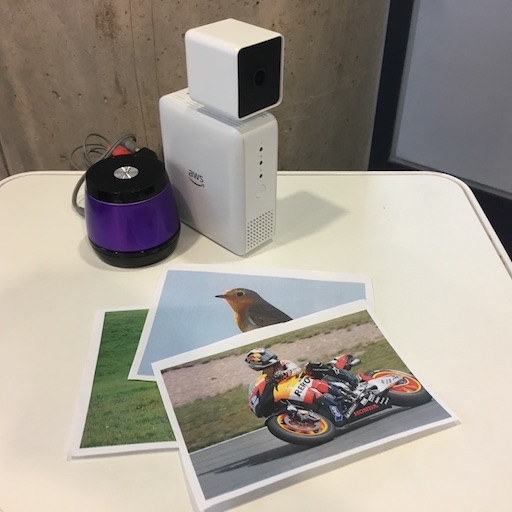

# Dee



Meet Dee, the *DeepLens Educating Entertainer*.

Dee is a prototype for how image recognition can be used to make educational tools.
It's designed to work with young or less-abled children who may struggle to interact
with computers using voice or keyboard/touchscreen.

## What does it do?

Dee asks questions, by speaking. Her questions ask the participant to show something. The questions (in a JSON file and easily extended) have answers that are one of four animals (bird, cow, horse and sheep) or four forms of transport (aeroplane, bicycle, bus and motorbike). Some questions have just one right answer (e.g. "What says moo?") and some can have several (e.g. "What has wheels?"). Right answers are praised and wrong ones are given not-very-subtle hints to get it right. (This is about interaction and positive reinforcement, rather than being a challenging quiz.)

The participant answers the questions by showing Dee a the relevant object. Because you probably don't have those animals and forms of transport to hand, a PDF of pictures ([cards.pdf](cards.pdf)) is provided which you can print out and use.

## What model does it use?

This uses the one of DeepLens's predefined models, `deeplens-object-detection`.

## What you need

* An AWS [DeepLens](https://aws.amazon.com/deeplens/)
* A speaker to attach to the DeepLens
* Optionally, a printout of [cards.pdf](cards.pdf)

## How to install

### Part 1: Configure DeepLens

* This is assuming DeepLens is already set up and registered
* On the DeepLens device, install gstreamer and Python's `playsound` library:

```
sudo apt-get install python-gst-1.0 gstreamer1.0-fluendo-mp3§
sudo pip install playsound
```

### Part 2: Create the Lambda:

* Create a Lambda function, with a name such as 'dee', using Python 2.7. It can use the standard `AWSDeepLensLambda` role.
* Change the handler to `dee.function_handler`
* I've given it memory of 1536MB (though haven't checked how appropriate this is).
* Upload the code. The `deploy.sh` script can help with this.
* Publish the function.

### Part 3: Create and deploy the project

* In the AWS web console, create a new DeepLens project, called e.g. 'dee'. Use the 'Create a new blank project' option
* Add the model `deeplens-object-detection`
* It will probably look a bit like this:
* Finally, add it to your DeepLens device.

### Part 4: Grant audio rights to the deployed Lambda

The GreenGrass container cannot access audio.
This fixes it (provided via https://forums.aws.amazon.com/thread.jspa?messageID=826041&#826041):

* On the DeepLens device, open `/opt/awscam/greengrass/ggc/deployment/group/group.json`
* Find the section containing `"/dev/dri/renderD128"`
* Copy it twice more, and change the SourcePath in one to `"/dev/snd/controlC0"` and the other to `"/dev/snd/pcmC0D0p"`. Also change the `"Id"` field to `"audio1"` and `"audio2"`.
* Then, within the first ‘ResourceAccessPolicies’ array further down, add two more entries for `"audio1"` and `"audio2"`.

* Lastly, don't forget to ensure you have a speaker attached to your DeepLens, so you can hear Dee speaking to you!

## What about the AWS Polly integration?

This repo includes the 69 MP3 files required for Dee to speak. It does not require Polly to operate.

If you change the questions, or want to change the choice of voice, use [download_phrases.py](download_phrases.py) to download the phrases from Polly again.
